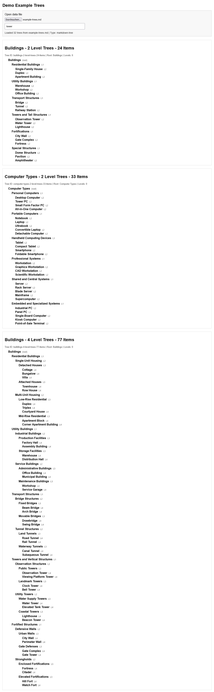

# Multi Level Example Trees


Neutral example tree datasets for testing tree views, JSON views, XML views, parsers, import pipelines, and hierarchical UI components.

## Description

This repository provides neutral hierarchical example data for developers who need ready-to-use trees for:

- tree view components
- JSON viewers
- XML viewers
- parser tests
- import and export tests
- hierarchical UI prototypes
- sample datasets for development and debugging

The dataset is intentionally broad, neutral, and non-branded.

## Screenshot

<a href="assets/img/screenshot-demo-example-trees.jpg">
  
</a>

Click the preview image to open the full-size screenshot.

## Included Formats

The same dataset is provided in multiple formats:

- Markdown
- Nested Tree JSON
- Flat Nodes Tree JSON
- Nested Tree XML
- Flat Nodes Tree XML
- Flat Nodes Tree CSV
- Flat Nodes Tree SQL

A small HTML demo is also included for loading and rendering the supported data files locally.

## Dataset Overview

The dataset currently includes the following tree groups and topics:

### Trees with 2 Levels

- Buildings - 2 Levels
- Celestial Bodies - 2 Levels
- Geometric Shapes and Solids - 2 Levels
- Mythical Creatures - 2 Levels
- Plant Forms - 2 Levels
- Tools - 2 Levels
- Weather and Natural Phenomena - 2 Levels

### Trees with 3 Levels

- Cables and Signal Types - 3 Levels
- Computer Ports and Connectors - 3 Levels
- Computer Types - 3 Levels
- Geometric Shapes and Solids - 3 Levels
- Rocks and Minerals - 3 Levels
- Vehicle Types - 3 Levels

### Trees with 4 Levels

- Buildings - 4 Levels
- Chemical Elements - 4 Levels
- Computer Types - 4 Levels
- Hi-Fi Devices - 4 Levels
- Landscape Forms - 4 Levels
- Machines and Mechanical Components - 4 Levels
- Tools and Equipment - 4 Levels

### Trees with 5 Levels

- Clothing Types - 5 Levels
- Container and Storage Types - 5 Levels
- Furniture Types - 5 Levels
- Materials - 5 Levels
- Signage, Symbols and Markings - 5 Levels
- Vehicle Types - 5 Levels

### Trees with 6 Levels

- Materials - 6 Levels
- Plant Types - 6 Levels

### Trees with 7 Levels

- Clothing Types - 7 Levels

### Trees with 8 Levels

- Animal Types - 8 Levels

## Level Counting Rule

Level counting uses this convention:

- the single root node is treated as Level 0
- Level 0 is not counted as part of the named depth group
- the first child layer below the root is Level 1
- the next layer is Level 2
- and so on

Example:

- Root node only = Level 0
- Root -> Category -> Item = Two Levels
- Root -> Category -> Subcategory -> Item = Three Levels

## Data Characteristics

The datasets are designed to be:

- neutral
- reusable
- non-political
- non-branded
- safe for public developer examples
- suitable for shallow and deep nesting tests

Topics are chosen to avoid unnecessary controversy and to work well as generic structural data.

## Demo

The included demo can load and render:

- Markdown trees
- Flat Nodes CSV
- Flat Nodes JSON
- Nested Tree JSON
- Flat Nodes XML
- Nested Tree XML

Open `demo.example-trees.html` in a browser and load one of the supported files.

## Filter Behavior

The demo filter uses simple text matching on the full visible text content of each rendered tree block.

This means:

- the filter checks the complete text of one tree block as a single string
- matching is case-insensitive
- if the entered text appears anywhere inside that tree block, the whole block stays visible
- if the entered text does not appear, the whole block is hidden

Important limitations:

- the filter does not search individual nodes separately
- the filter does not reduce a tree to only matching branches
- the filter does not highlight matches
- a single matching word anywhere in one tree keeps the entire tree visible

Example:

- searching for `tower` keeps every tree visible that contains `tower` somewhere in its text
- searching for a term that does not exist in a tree hides that whole tree block

This is intended as a very simple demo filter, not as a full node-level tree search.

## Use Cases

Examples:

- test a recursive tree renderer
- test flat node to tree reconstruction
- test XML import
- test CSV import
- benchmark nested data handling
- verify expand and collapse behavior
- populate sample data in internal tools


## Repository Structure

```text
data-example-trees
├── assets
│   ├── css
│   │   └── demo.example-trees.css               # Stylesheet for the local HTML demo
│   ├── img
│   │   └── screenshot-demo-example-trees.jpg    # Screenshot preview for the README
│   └── js
│       └── demo.example-trees.js                # Parser and renderer for the local HTML demo
├── data
│   ├── example-trees.flat-nodes-tree.csv        # Flat node dataset in CSV format
│   ├── example-trees.flat-nodes-tree.json       # Flat node dataset in JSON format
│   ├── example-trees.md                         # Markdown dataset source file
│   ├── example-trees.flat-nodes-tree.sql        # Flat node dataset as SQL insert data
│   ├── example-trees.flat-nodes-tree.xml        # Flat node dataset in XML format
│   ├── example-trees.nested-tree.json           # Nested tree dataset in JSON format
│   └── example-trees.nested-tree.xml            # Nested tree dataset in XML format
├── CHANGELOG.md                                 # Version history
├── demo.example-trees.html                      # Simple local demo for loading and viewing the datasets
└── README.md                                    # Project overview, usage notes, and dataset description
```

## Versioning

This repository uses semantic versioning.

Current version:
- `v0.1.0`

Version details are tracked in:

- `CHANGELOG.md`

## License

MIT License

See `LICENSE` for details.
